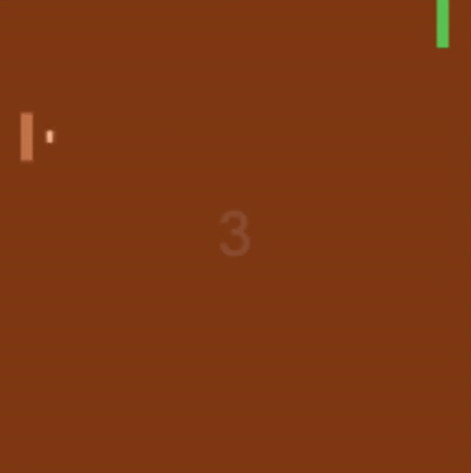

# Genetic reinforcement algorithms in JavaScript
This repository contains my experimental sandbox for Genetic Algorithms in JavaScript for reinforcement learning environments.

# Pong
For example, it is able to train on a clone of the Pong game for Atari 2600




## How to use

Configure the genCount in the js/main.js to determine the amount of generations you want the agent (called individual in the code) to train for.

After training ends (count == genCount) you can see the agent play agents the heuristic CPU agent by calling:

```javascript
// Change second argument to control the game speed.
window.individualPlay(window.bestIndividual, 5) 
```

Have fun!